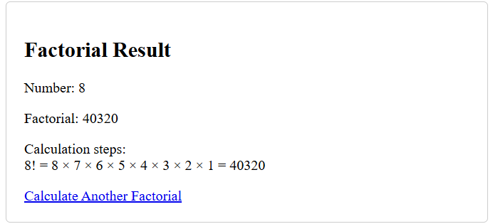
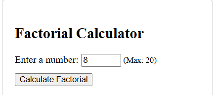
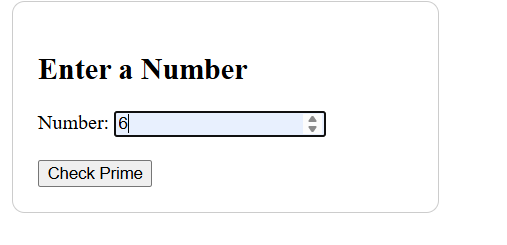
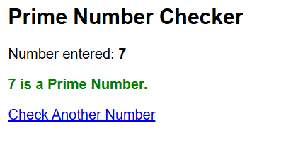

# Advanced Java Lab 6 - Servlet Programs

## Output Links

### 1. Cookie Management Servlet
- **Program File:** [CookieServlet.java](./CookieManagement/CookieServlet/src/main/java/cookieservlet/CookieServlet.java)
- *(No output image provided)*

---

### 2. Factorial Calculator
- **Program File:** [FactorialServlet.java](./Factorial/FactorialServlet.java)
- **Demo Class:** [FactorialCalculatorDemo.java](./Factorial/FactorialCalculatorDemo/src/main/java/FactorialCalculatorDemo.java)
- **Output Images:**
  - 
  - 

---

### 3. Prime Number Checker
- **Program File:** [PrimeServlet.java](./primechecker/PrimeServlet.java)
- **Servlet:** [PrimeCheckerServlet.java](./primechecker/PrimeCheckerServlet/src/main/java/PrimeCheckerServlet.java)
- **Output Images:**
  - 
  - 

---

